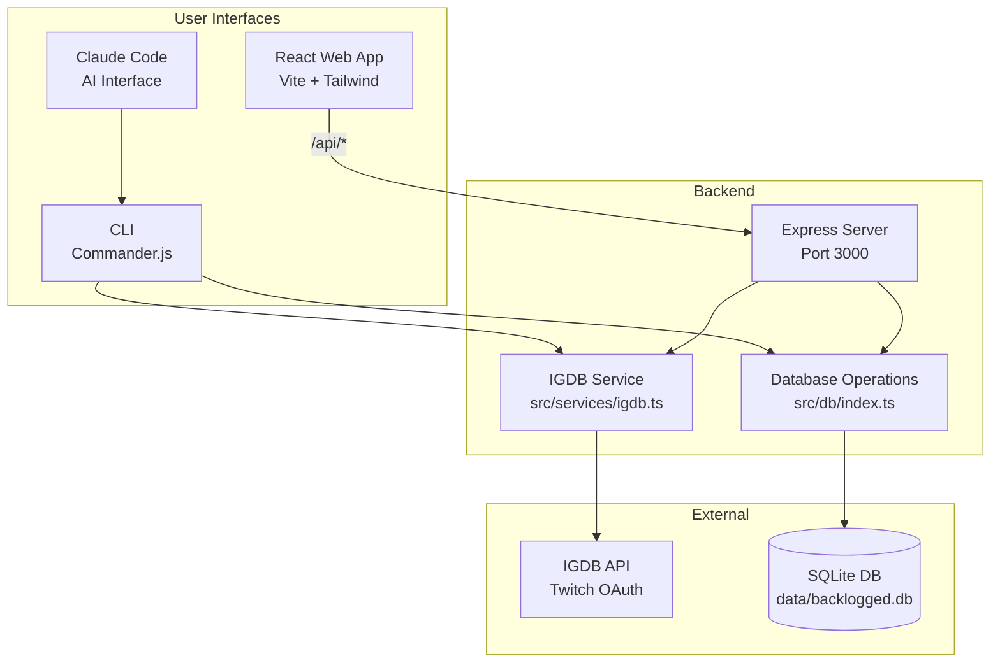
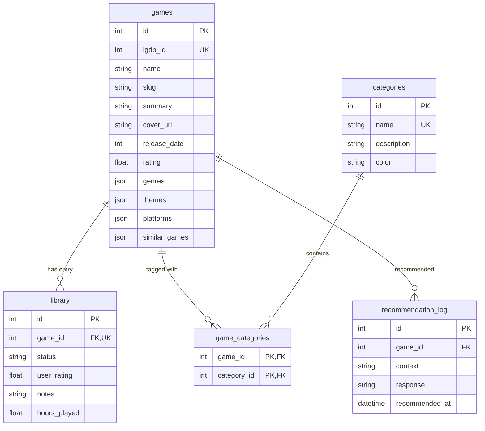
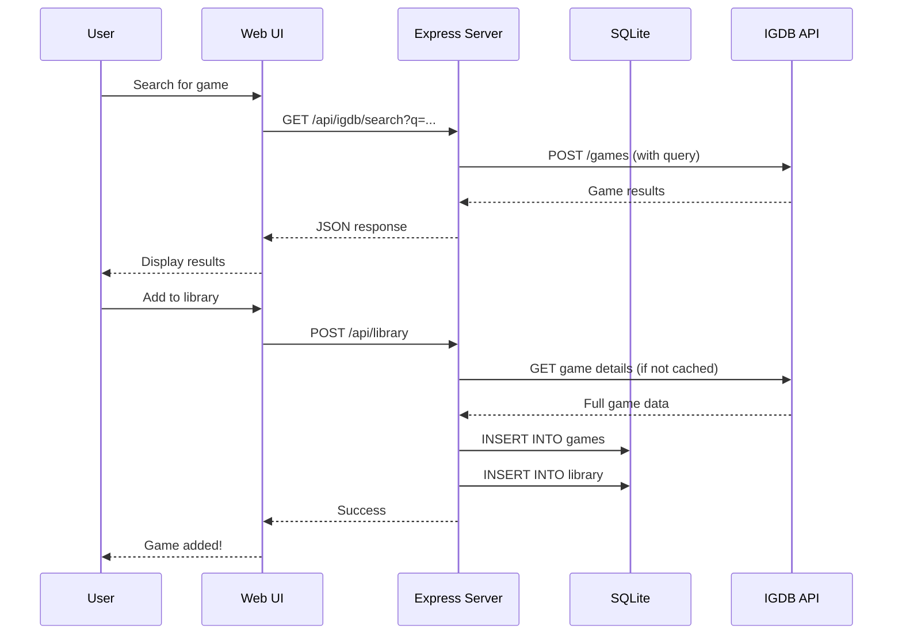

# Backlogged - Project Review

## Executive Summary

**Backlogged** is a personal game library and discovery app powered by IGDB. It's designed to work with Claude Code as an AI-powered game librarian. The codebase has three main components:

| Component | Maturity | Notes |
|-----------|----------|-------|
| **CLI** | Good | Well-structured, functional, minor issues |
| **Backend API** | Functional | Works but has security/validation gaps |
| **Web UI** | Rough | Dark mode broken, some bugs, incomplete features |

---

## Architecture Overview



---

## Data Model



---

## Request Flow



---

## Tech Stack

| Layer | Technology | Version |
|-------|------------|---------|
| Database | SQLite (better-sqlite3) | 11.6.0 |
| Backend | Express.js | 4.21.0 |
| Frontend | React | 18.3.1 |
| Routing | React Router | 7.0.2 |
| Data Fetching | TanStack React Query | 5.62.7 |
| Styling | Tailwind CSS | 3.4.16 |
| Build | Vite | 6.0.3 |
| CLI | Commander.js | 12.1.0 |
| TypeScript | | 5.7.2 |

---

## File Structure

```
backlogged/
├── src/                    # Shared core library
│   ├── cli/index.ts        # CLI entry (commander)
│   ├── db/
│   │   ├── index.ts        # DB operations (552 lines)
│   │   ├── schema.ts       # SQL schema
│   │   └── init.ts         # DB initialization
│   ├── services/igdb.ts    # IGDB API client
│   └── types/index.ts      # TypeScript types
│
├── server/                 # Express backend
│   ├── index.ts            # Server entry
│   └── routes/             # API route handlers
│       ├── library.ts
│       ├── games.ts
│       ├── igdb.ts
│       ├── categories.ts
│       └── stats.ts
│
├── web/                    # React frontend
│   ├── src/
│   │   ├── app.tsx         # Main app + routing
│   │   ├── pages/          # Page components
│   │   ├── components/     # UI components
│   │   ├── hooks/          # Custom hooks
│   │   └── lib/api.ts      # API client
│   └── tailwind.config.ts
│
└── data/                   # Runtime data
    ├── backlogged.db       # SQLite database
    └── token.json          # IGDB OAuth token
```

---

## API Endpoints

| Method | Endpoint | Description |
|--------|----------|-------------|
| GET | `/api/library` | List library (with filters) |
| POST | `/api/library` | Add game to library |
| PUT | `/api/library/:gameId` | Update library entry |
| DELETE | `/api/library/:gameId` | Remove from library |
| GET | `/api/games/:igdbId` | Get cached game |
| GET | `/api/igdb/search` | Search IGDB |
| GET | `/api/igdb/game/:id` | Get IGDB game details |
| GET | `/api/igdb/discover` | Discover games |
| GET | `/api/stats` | Library statistics |
| GET | `/api/categories` | List categories |
| POST | `/api/categories` | Create category |
| POST | `/api/categories/games/:gameId/:categoryId` | Tag game |
| DELETE | `/api/categories/games/:gameId/:categoryId` | Untag game |

---

## CLI Commands

| Command | Description |
|---------|-------------|
| `search <query>` | Search IGDB for games |
| `add <igdbId>` | Add game to library |
| `update <igdbId>` | Update library entry |
| `remove <igdbId>` | Remove from library |
| `library` | View library (with filters) |
| `stats` | Show statistics |
| `discover` | Discover games (popular, recent, by genre) |
| `categories` | List categories |
| `category-add <name>` | Create category |
| `tag <igdbId> <categoryId>` | Tag game with category |
| `local-search <query>` | Search local database |
| `rec-log <igdbId>` | Log AI recommendation |
| `rec-respond <logId> <response>` | Respond to recommendation |
| `rec-history` | View recommendation history |

---

## Database Schema

### Tables

**games** - Cached IGDB data
- `id`, `igdb_id` (unique), `name`, `slug`, `summary`, `cover_url`
- `release_date`, `rating`, `rating_count`
- `genres`, `themes`, `platforms`, `game_modes`, `similar_games` (JSON arrays)

**library** - User's collection
- `id`, `game_id` (unique, FK), `status`, `user_rating`, `notes`, `hours_played`
- Status: `backlog`, `playing`, `played`, `dropped`, `wishlist`, `skipped`

**categories** - Custom tags
- `id`, `name` (unique), `description`, `color`

**game_categories** - Many-to-many junction
- `game_id` (FK), `category_id` (FK)

**recommendation_log** - AI recommendation history
- `id`, `game_id` (FK), `context`, `response`, `recommended_at`

---

## Known Issues

### Critical (Broken Functionality)

| Issue | Location | Description |
|-------|----------|-------------|
| API method mismatch | `web/src/lib/api.ts:159` | Frontend sends PATCH, server expects PUT - library updates broken |
| Dark mode CSS | `web/src/styles/globals.css:40-43` | `.dark body` selector wrong - dark mode broken |
| useState bug | `web/src/pages/game-page.tsx:61-65` | Should be useEffect - notes initialization broken |

### Medium (Incomplete Features)

| Issue | Location | Description |
|-------|----------|-------------|
| List view missing | `web/src/pages/library-page.tsx` | Toggle exists but only grid view implemented |
| View Games button | `web/src/pages/categories-page.tsx:233` | No onClick handler |
| Missing CLI commands | CLI | No `untag`, `category-delete` commands |
| `skipped` not in stats | `src/cli/index.ts:268-281` | Count tracked but not displayed |
| Dark mode inconsistent | Multiple components | Mix of CSS vars and hardcoded colors |

### Low (Polish)

| Issue | Description |
|-------|-------------|
| N+1 queries | `getLibrary()` runs separate query per game for categories |
| No graceful shutdown | DB connection never closed |
| Timestamp formats | `release_date` is INT, others are TEXT |

---

## Development Commands

```bash
# Development
npm run dev          # Run API + web concurrently
npm run dev:api      # Run Express server only
npm run dev:web      # Run Vite dev server only

# Build
npm run build        # Compile TypeScript + build web
npm run typecheck    # Type check without emit

# CLI
npm run cli -- <command>
npm run db:init      # Initialize database
```
